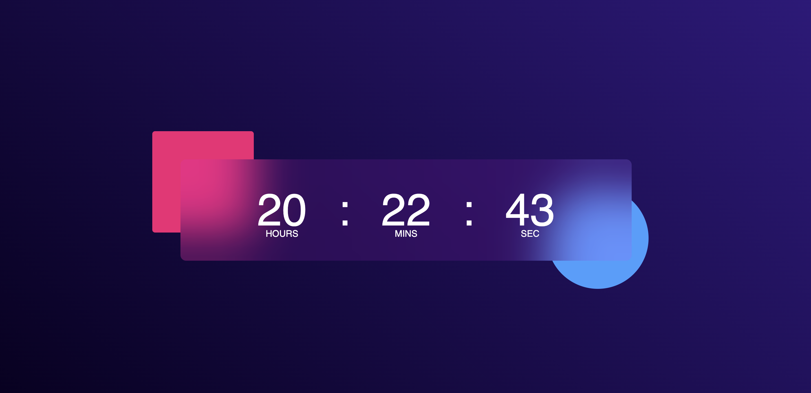

# 🕒 Digital Clock App

A simple and responsive Digital Clock App built using React.js.  
This app displays the current time in real-time with a clean user interface.

---

## 🚀 Features

- Real-time digital clock ⏰
- Automatic time updates every second
- Responsive design
- Simple and clean UI
- 12-hour / 24-hour format support

---

## 🛠️ Technologies Used

- HTML
- JavaScript
- CSS

---

## 📸 Screenshots

### Home Page

